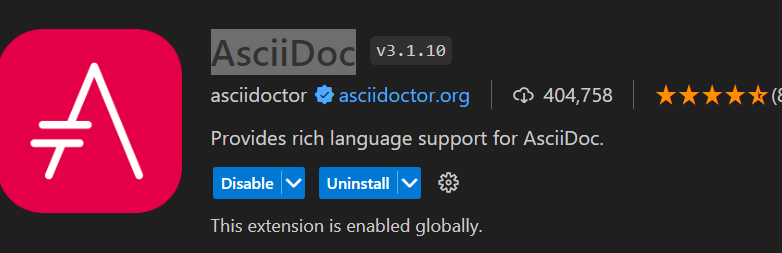

:toc: left
:icons: font
:author: Bichler Bastian 
:toc-title: Inhalt
:sectnums: section
= AsciDoc Syntax

==  Starten mit Asciidoc
Als erstes muss Ruby installiert sein das kannst du link:https://rubyinstaller.org/[hier] machen. 
Wenn Ruby installiert ist führe diesen Befehl in der Console aus. 
[source, batch]
----
gem install asciidoctor
----

Im anschluss die Ruby Cmd öffnen und 1 und 2 Installieren 

==  Extensions Installieren 
Mit dieser Extension kannst du sehen wie die Datei aussehen würde. 
Installiere hierzu die Extensions für VS Code

Um es nun zu verwenden verwende *STRG + SHIFT + V*

==  Erstellen der Asciidoc Datei
Erstelle eine Datei mit der Endung .adoc

== Syntax
Die Syntax ist sehr einfach und leicht zu verstehen.
=== Formatierung

==  Überschriften 
Die Überschriften werden mit einem = eingeleitet.
je mehr = desto kleiner wird die Überschrift

Mit 3x "*-*" Macht mein einen Unterschstrich dieser wird aber eh bei 2x= mitgemacht

==  Checkboxen

* [*] checked
* [x] also checked
* [ ] not checked
* normal list item

Um Checkboxen zu erstellen machst du das hier

|===
|* [*] checked
|* [x] also checked
|* [ ] not checked
|===

Eine einrückung kannst du mit "::" machen hinter einen wort

test::
    der Test 

==  Tabellen erstellen 
[source]
----
|===
|Column 1, Header Row |Column 2, Header Row :red 
|Column 1, Row 1, hi
|Column 2, Row 1, hi
|Column 1, Row 2, max
|Column 2, Row 2, max
|===

----
Hier wird mit den "|===" das Ende und der Anfang definiert
mit "|" wird eine neue Spalte erstellt

==  Admonitions

Es gibt bestimmte Aussagen, auf die Sie aufmerksam machen möchten, indem Sie sie aus dem Fluss des Inhalts herausnehmen und ihnen eine Priorität zuweisen. Man nennt sie Ermahnungen. Auf dieser Seite erfahren Sie, welche Hinweistypen AsciiDoc bereitstellt, wie Sie Ihrem Dokument Hinweise hinzufügen und wie Sie diese mithilfe von Symbolen oder Emojis verbessern.

Liste von Admonitions:: 

* NOTE
* TIP
* IMPORTANT
* CAUTION
* WARNING

Um diese Icons nun zu verwenden muss `icons` eingeschaltet sein sonst steht nur der Text da.

[source, adoc]
----
:icosn: font

[NOTE]
====
Das ist ein Notiz # oder eine andere aus der Liste
====

oder 
WARNING: text
----

Bei den unteren wird es erst beendet wen eine leerzeile zwischen der Admonitions und den normalen Text 

Verwendung: 
[source, adoc]
----
[NOTE]
====
Ein Beispiel für eine Notiz.
====
----
[NOTE]
====
Ein Beispiel für eine Notiz.
====

==  Links und Bilder
Links und bilder werden mit einem *link:* eingeleitet und Bilder mit einen *image:*

Beispiel::
[source, target]
----
link:https://www.google.com[Klick mich] 
image:pfad[alternativer Text]
----
link:https://www.google.com[Klick mich] 

Natürlich können Lokale dateien Auch Verlinks sein oder Bilder

==  Listen erstellen 

um eine Auflistung zu erstellen brauchen wir das :: und ein * oder . 
[source, target]
----
beispiel:: 
* hi
----

beispiel:: 
* hi

[source, target]
----
beispiel:: 
. hi
.. hi
... hi
----

beispiel:: 
. hi
.. hi
... hi

==  Umrandungen 
[source, target]
----
====
The book hit the floor with a *thud*.

He could hear doves *cooing* in the pine trees`' branches.
====
----

.Onomatopoeia
====
The book hit the floor with a *thud*.

He could hear doves *cooing* in the pine trees`' branches.
====

== Code Block 
[source, target]
----
[source, target]
"----"

Code Bla bla
"----"

----

Hier im code Natürlich ohne die " "

==  Verse Style 
[verse,Carl Sandburg, two lines from the poem Fog]
The fog comes
on little cat feet.

Hier sehen wir das die normalen Zeilen geschreiben wreden und unten ein Verse noch eingefügt wird. 

[source, adoc]
----
[verse,Carl Sandburg, two lines from the poem Fog]
The fog comes
on little cat feet.
----

==  Open Blocks

mit den `word` können wir "Öffnungsblöcke" erstellen. 

[source, adoc]
----
[sidebar]
.Related information
--
This is aside text.

It is used to present information related to the main content.
--
----

[sidebar]
.Related information
--
This is aside text.

It is used to present information related to the main content.
--

==  Kommentare 

Kommentare sind abunzu sehr wichtig. 

[source, adoc]
----
* first text

// Commentar das ist ein Test 

* second text
----

* first text

// Commentar das ist ein Test 

* second text

oder in einen Code Block

[source, adoc]
----
[comment]
Das ist ein kommentar 
----

[comment]
Das ist ein Kommetar 

oder 

[source, adoc]
----
////

HIer kommen Kommentare 
 ////
----

== Automatische Nummerierung

Um eine Automatische Nummerierung zu erstellen können wir `:sectnums: section` verwenden. 

Hier wird dann von oben nach unten die Nummerierung erstellt.

Andere Übergabeparameter 

== Source Code Highlighter

Es gibt mehrere Highlighter die wir verwenden können.

`:source-highlighter:`

* coderay
* highlight.js
* pygments
* rouge

In meinen Fall benutze ich `highlight.js` diese muss nur ganz oben in der Datei eingefügt werden.

[source , adoc]
----
:source-highlighter: highlight.js
----

== PDF einbinden

Natürlich können wir hier auch pdfs einbinden mit 

==  Navigation-Leiste 
Um eine Navigation-Leiste zu erstellen brauchen wir das hier
[source, adoc]
----
:toc: left
----

Um Links eine Navigations leiste zu erstellen diese Erekennt alle == und === und Verlinkt diese miteinander 

Standart Gemäs ist dies auf :toc-level: 2 Heißt wir können an der Seite nur bis einen Unterpunkt machen wenn wir dies Erhöhen können wir 5 angeben dann können wir bis zu `=====` 5 machen und diese So unterkatogerisieren. 

[[Umwandeln]]
== Umwandeln in HTML oder PDF 

[source, code]
----
asciidoctor input.adoc
----
Um eine Asciidoctor zu erstellen in Html zu erstellen 

[source, code]
----
asciidoctor-pdf beispiel.adoc
----
Gerne hier weiteres Zum Nachlesen zu Befehlen in Asciidoc 
link:https://phlow.de/magazin/terminal/asciidoctor/[Klick Mich]

