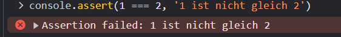
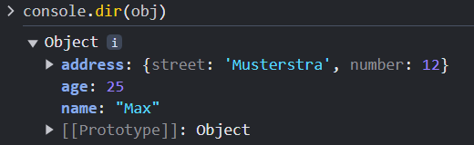
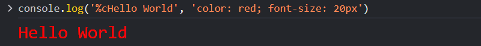
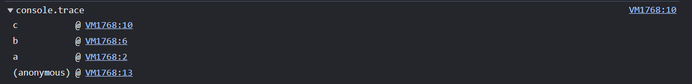
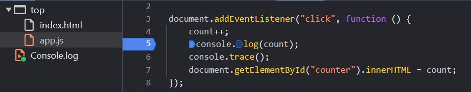
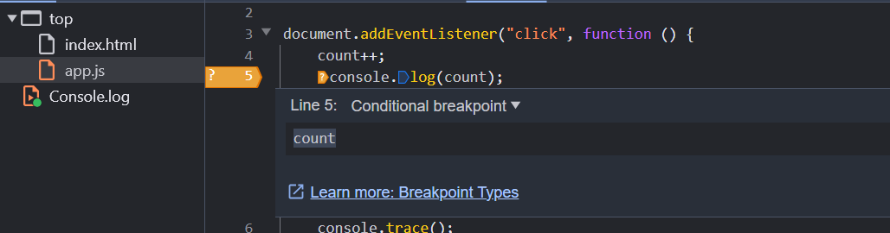
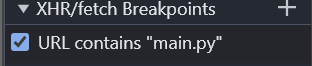
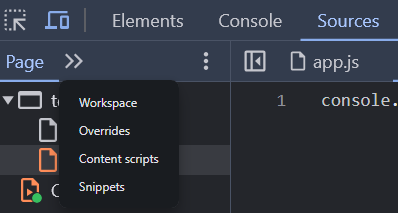

:toc: left
:author: Bichler Bastian
:source-highlighter: highlight.js
:toc-title: Inhalt
:sectnums: section
:icons: font
:email: bichlerbastian@gmail.com
:imgdir : img

= DevTools Chrome 

== Öffnen der DevTools

Die DevTools können auf verschiedene Arten geöffnet werden 

* Rechtsklick auf eine Webseite und dann auf "Untersuchen" klicken
* F12 drücken
* Strg + Shift + I drücken
* Strg + Shift + J drücken

== Console 

===  Assert 

Mit dem Assert Befehl kann ein Ausdruck überprüft werden. Wenn der Ausdruck falsch ist wird eine Fehlermeldung ausgegeben.

* `console.assert(1 === 2, '1 ist nicht gleich 2')` - Überprüft ob 1 gleich 2 ist

[source, javascript]
----
console.assert(1 === 2, '1 ist nicht gleich 2')
----

=== Ausgabearten  
* `console.log('Hello World')` - Gibt Hello World in der Console aus
* `console.info('Info')` - Gibt Info in der Console aus
* `console.error('Error')` - Gibt Error in der Console aus
* `console.warn('Warnung')` - Gibt Warnung in der Console aus
* `console.clear()` - Löscht die Console

=== Count

Mit der count Funktion kann gezählt werden wie oft ein bestimmter Befehl ausgeführt wurde.

* `console.count('Count')` - Zählt wie oft der Befehl ausgeführt wurde
* `console.countReset('Count')` - Setzt den Zähler zurück

[source, javascript]
----
console.count('Count') // 1
console.count('Count') // 2
console.count('Count') // 3
console.count('Count') // 4
console.countReset('Count') // 0
----

=== Debug

Mit der debug Funktion kann ein Breakpoint gesetzt werden. Dieser wird gesetzt wenn die Console geöffnet ist.

* `console.debug('Debug')` - Setzt einen Breakpoint

[source, javascript]
----

console.debug('Debug')
----

=== Dir 

Mit der dir Funktion können Objekte in der Console ausgegeben werden.
Der Vorteil hier ist das die Objekte aufgeklappt werden können und so die Struktur des Objektes besser sichtbar ist.

* `console.dir(obj)` - Gibt das Objekt in der Console aus

[source, javascript]
----

const obj = {
    name: 'Max',
    age: 25,
    address: {
        street: 'Musterstra',
        number: 12
    }
}

console.dir(obj)
----

=== Gruppierung

Mit der Gruppierung können mehrere Ausgaben in einer Gruppe zusammengefasst werden diese können dann zusammen und aufgeklappt angezeigt werden.

* `console.group('Gruppe')` - Öffnet eine Gruppe
* `console.groupEnd()` - Schließt eine Gruppe

[TIPP]
----
console.groupCollapsed('Gruppe') - Öffnet eine Gruppe und klappt sie sofort zusammen 
----

=== Style der Console

Mit der Style Funktion können die Ausgaben in der Console gestylt werden.

* `console.log('%cHello World', 'color: red; font-size: 20px')` - Gibt Hello World in der Console aus und stylt es

%c - Wird verwendet um den Style zu setzen das %c wird durch den Style ersetzt

[source, javascript]
----
console.log('%cHello World', 'color: red; font-size: 20px')
----

=== Table

Mit der table Funktion können Arrays in einer Tabelle ausgegeben werden.

* `console.table(array)` - Gibt das Array in einer Tabelle aus

[source, javascript]
----
const array = [
    {name: 'Max', age: 25},
    {name: 'Peter', age: 30},
    {name: 'Hans', age: 35}
]

console.table(array)
----

=== Trace 

Der Trace Befehl gibt den Stacktrace aus. Hiermit kann nachvollzogen werden wie eine Funktion aufgerufen wurde. Und woher sie aufgerufen wurde.

* `console.trace()` - Gibt den Stacktrace aus

[source, javascript]
----
function a() {
    b()
}

function b() {
    c()
}

function c() {
    console.trace()
}

a()

----

=== Zeitmessung

Mit der Zeitmessung können die Zeiten von Funktionen oder Schleifen gemessen werden.

* `console.time('Zeit')` - Startet die Zeitmessung
* `console.timeEnd('Zeit')` - Beendet die Zeitmessung
* `console.timeLog('Zeit')` - Gibt die Zeit aus 

== Debugging  

=== Breakpoints Code 

Mit Breakpoints können an bestimmten Stellen im Code Breakpoints gesetzt werden. Diese werden dann ausgeführt wenn die Console geöffnet ist.

* `debugger` - Setzt einen Breakpoint mit Code 

[source, javascript]
----

function a() {
    debugger
    console.log('Hello World')
}

a()
----

=== Breakpoints setzen

An bestimmten Stellen im Code können Breakpoints gesetzt werden. Diese werden dann ausgeführt wenn die Console geöffnet ist.

==== Source 

In der Source können Breakpoints gesetzt werden. Dazu muss die DevTools geöffnet sein und dann auf *Source* geklickt werden. Dort kann dann der Code geöffnet werden und Breakpoints gesetzt werden.

Einfach auf die Zeile klicken wo der Breakpoint gesetzt werden soll.

Der Breakpoint kann nun auch nur bei bestimmten Bedingungen ausgeführt werden. Dazu einfach Rechtsklick auf den Breakpoint und dann *Edit Breakpoint* auswählen.

Dort können dann bedinungen eingestellt werden wie:

* Wenn eine Variable einen bestimmten Wert hat
* Wenn eine Funktion aufgerufen wird
* Wenn eine Exception geworfen wird

[source, javascript]
----

- count === 4 
- name === 'Max'
- a()
- throw new Error('Error')
----

Diese werden dann in einer anderen Farbe angezeigt 

==== Watch

In der Watch können Variablen überwacht werden. Dazu muss die DevTools geöffnet sein und dann auf *Source* klicken. Dort kann dann auf *Watch* geklickt werden und die Variablen eingetragen werden.

Pause on caught  - Wenn eine Exception gefangen wird wird der Code angehalten
Pause on uncaught exceptions - Wenn eine Exception nicht gefangen wird wird der Code angehalten

fetch - Wenn Fetch aufgerufen wird wird der Code angehalten

z.b Nur wenn main.py in den Fetch eingetragen wird wird der Code angehalten wenn Fetch aufgerufen wird. 

==== Elements 

In den Elements können Breakpoints gesetzt werden. Dazu muss die DevTools geöffnet sein und dann auf *Elements* klicken. Dort kann dann auf *Breakpoints* geklickt werden und die Breakpoints eingetragen werden.

Diese sind für DOM Elemente und können dann ausgeführt werden wenn das Element geändert wird.

durch javascript 

z.b Wenn ein Element geändert wird wird der Code angehalten

[source, javascript]

----

document.querySelector('button').addEventListener('click', () => {
    document.querySelector('h1').textContent = 'Hello World'
})

----

== Run Befehl 

Mit dem Run Befehl können Befehle in der Console ausgeführt werden.

Strg + Shift + P drücken und dann Run eingeben. Hier können Befehle eingegeben werden die dann ausgeführt werden.

== Snippets

Mit Snippets können Code Schnipsel gespeichert und ausgeführt werden. Diese werden in der DevTools gespeichert und können jederzeit ausgeführt werden. Um diese zu öffnen muss die DevTools geöffnet sein dann auf *Source* klicken und auf den kleinen 2 Pfeil klicken dort können die Snippets geöffnet werden.

Dort können dann die Snippets erstellt und ausgeführt werden. Diese sind dann auf jeder Seite verfügbar.

image::img/Snippets.png[]

