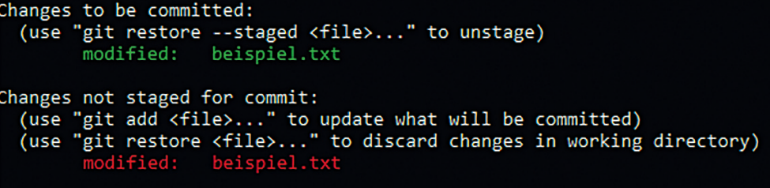

:toc-title: Inhalt
:toc: left
:author: Bichler Bastian
:icons: font
:source-highlighter: rouge
:listing-caption: Code
:sectnums: section

= Überblick über Git

Git ist ein Versionskontrollsystem von Linus Torvalds für Softwareprojekte.

== Grundkonzepte

- Repositorium: Enthält Projektdateien, Historie und Konfiguration.
- Commit: Sammlung von Änderungen zu einem Zeitpunkt.
- Branch: Isolierter Entwicklungszweig für unabhängige Arbeit.
- Merge: Zusammenführen von Branch-Änderungen.
- Pull Request: Vorschlag zur Code-Integration.

== Installation 
=== Windows
Installiere link:https://git-scm.com/download/win[Git for Windows].

Nutze Git Bash für Linux-Terminal-ähnliche Eigenschaften.

=== Linux 
Prüfe, ob Git installiert ist:
```bash
apt install git-all
``` 

=== Konfiguration

Git bietet Anpassungsmöglichkeiten für bessere Arbeitsabläufe. Wesentliche Einstellung: Name und E-Mail.

=== Konfigurationsoptionen

Konfigurationsdateien: gitconfig und .gitconfig.
Konfiguration über die Kommandozeile:

[source, git]
----
git config --global user.name "Max Mustermann"
git config --global user.email meinemail@beispiel.de
----

wir können diese auch *"Lokaler Datenträger (C:) > Programme > Git"* finden. => *"C:\Programs\Git"*

=== Weitere Konfigurationsoptionen

Texteditor ändern:
[source, git]
----
git config --global core.editor geany
----
Dies könnte auch mit nano, vim oder emacs, etc erfolgen.

=== Hauptzweig bennen

[source , git]
----
git config --global init.defaultBranch neuer_hauptzweig_name
----

=== Farbige ausgabe deaktivieren

[source, git]
----
git config --global color.ui false
----

Diese Option sind meist für Anfänger relevant.

=== Konfiguration prüfen
`git config --list` zeigt alle Konfigurationsoptionen.

Hinweis: Der gekürzte Text dient nur zu Illustrationszwecken. Beachten Sie, dass einige Details möglicherweise verloren gegangen sind.


== Git-Hilfe
Die Git-Hilfe ist praktisch für Befehlsauskünfte. Der Befehl ist bekannt (hier: `config`).

[source, git]
----
git help config
git config --help
man git-config
git config -h
----

Alternativ: Git-Hilfe im Internet unter link:https://git-scm.com/[].

== Grundlagen der Arbeit mit Git

== Git-Repository: Ausgangspunkt
Ein Repository speichert Dateien und Historie. Zwei Arten, es zu erstellen: lokal und klonen.

=== Lokal erstellen

```shell
mkdir git-beispiel
cd git-beispiel
git init
dir
```

=== Klonen

```shell
git clone link/datei
```

=== Dateien hinzufügen

[source, git]
----
git status
git add datei
# oder
git add --all
----

=== Commits durchführen

[source, git]
----
git commit -m "Commit-Nachricht"
# oder
git commit
----

=== Dateien aktualisieren, verändern, löschen

[source, git]
----
# Änderungen vorbereiten
git add datei
# oder
git commit -a -m "Commit-Nachricht"
----

[IMPORTANT]
====
Beachte: git commit -a kombiniert add und commit für bereits hinzugefügte Dateien. Nicht verfolgte Dateien erfordern weiterhin add.
====


== Änderungen zwischen 'add' und 'commit'

Wenn Änderungen nicht mit `git commit -a` kombiniert werden und stattdessen einzeln mit `git add` und `git commit` durchgeführt werden, besteht die Gefahr von Inkonsistenzen. Um Fehler zu vermeiden, sollten nachträgliche Änderungen vor dem Commit erneut mit `git add` berücksichtigt werden.



=== Änderungen anzeigen lassen

Um Unterschiede zwischen Versionen zu sehen, bietet `git diff` eine Lösung. `git diff` zeigt Änderungen vor dem 'add'-Befehl an, während `git diff --staged` die Änderungen nach 'add' anzeigt.

== Daten löschen

Es ist wichtig, Dateien in Git korrekt zu löschen. Der Befehl `git rm` löscht eine Datei aus dem Arbeitsverzeichnis und der Staging-Area. Bei Bedarf kann `git rm --cached` verwendet werden, um eine Datei nur aus dem Repository zu entfernen.

[source, git]
----
git rm datei 
#lsöchen aus der Staging-Area 
git rm -f 
----

Durch den Befehl wird sie im Ordner und im Git Repository gelöscht.

=== Dateien umbenennen

Der Befehl `git mv` ermöglicht das Umbenennen von Dateien und berücksichtigt die Änderung im Repository.

[source, git]
----
git mv test.txt test2.txt
----

== Git rückgängig machen

Mit `git restore` können Änderungen an nicht gestagten Dateien rückgängig gemacht werden. Bei gestagten Dateien kann `git restore --staged` verwendet werden, gefolgt von erneutem `git restore` für vollständige Rückgängigmachung.

[source, git]
----
git restore franz_xaver.txt
git restore --staged franz_xaver.txt
----

Staging Area bedeutet, dass die Datei schon für den Commit vorbereitet ist. Hier wird die Datei wieder aus der Staging-Area entfernt. Deswegen muss hier dann nochmal der normale restore Befehl verwendet werden.

== Git nachträglich ergänzen

Mit `git commit --amend` können Änderungen zum letzten Commit hinzugefügt werden, ohne einen neuen Commit zu erstellen.

== Verlauf der Commits anzeigen

`git log` zeigt den Commit-Verlauf an, mit verschiedenen Optionen wie -p, --stat und Filtermöglichkeiten nach Autor oder Datum.

[source, git]
----
git log --author="Max Mustermann"
git log --before="2021-01-01"
git log --after="2021-01-01"
git log --until
git log --since="2021-01-01"
----

== Frühere Versionen wiederherstellen

Mit `git checkout` können frühere Versionen wiederhergestellt werden, wobei der HEAD-Zeiger auf unterschiedliche Commits zeigt.

[source, git]
----
git checkout bb78
----

Entweder wird der ganze Hashcode angegeben oder nur der eindeutige Teil. Nun, wenn wir die Datei wieder öffnen, sehen wir, dass die Datei wieder auf den Stand von vorher ist.

== Die Kennzeichnung HEAD

Manchmal ist es möglich, mit dem HEAD-Befehl zu den letzten oder letzten 2 Commits zurückzuspringen mit `git checkout HEAD~2` oder `git checkout HEAD~1` um in das letzte bzw. vorletzte Commit zu wechseln.

== Vorherige Version wiederherstellen und nachfolgende Änderungen löschen

Mit `git reset --hard` können vorherige Versionen wiederhergestellt und nachfolgende Änderungen gelöscht werden.

== Markierung mit Tags

Tags werden verwendet, um Commits zu markieren. Lightweight-Tags werden mit `git tag` erstellt, während annotated Tags zusätzliche Informationen enthalten und mit `git tag -a` erstellt werden.

[source, git]
----
git tag v1.0.0
git tag -a <TagName> -m "Deine Tag-Nachricht hier"
----

== Tags anzeigen

`git tag` zeigt vorhandene Tags an, und mit `git show` können weitere Details angezeigt werden.

[source, git]
----
git tag
git show name
----

== Nachträglich Tags hinzufügen

Nachträglich Tags zu einem früheren Commit hinzufügen Sie mit `git tag -a` und den ersten Zeichen des Hash-Werts.

[source, Git]
----
git tag -a version0.4 9cbec04 -m "Nachträgliches Tag für Version 0.4"
----

Um nachträglich Tags zu einem früheren Commit hinzuzufügen, können Sie den `git tag` Befehl verwenden und die ersten Zeichen des Hash-Werts des entsprechenden Commits angeben.

== Wechseln zum Tag

Zum Wechseln zu einem bestimmten Tag wird `git checkout tagname` verwendet.

[source, git]
----
git checkout tagname
----

== Tags Löschen

Tags können mit `git tag -d` gelöscht werden.

== Git Branchen

Die Erstellung, Wechsel, Zusammenführung und Löschen von Branches in Git ermöglicht eine flexible und parallele Entwicklung an unterschiedlichen Entwicklungssträngen.

== Neuen Zweig erstellen

Einen neuen Branch erstellen Sie mit `git branch neuerZweig`.

[source, git]
----
git branch neuerZweig
----

== Wechseln des aktuellen Branches

Zum Wechseln des aktuellen Branches verwenden Sie `git checkout` oder kombinieren Sie es mit `git checkout -b` für die Erstellung und den Wechsel in einem Schritt.

[source, git]
----
git checkout neuerZweig
git checkout -b neuerZweig
----

== Switch zwischen Branches

Mit `git switch` wechseln Sie zwischen Branches.

[source, git]
----
git switch anderer-zweig
----

== Zusammenführen von Branches

Änderungen aus einem Branch in einen anderen werden mit `git merge` integriert.

[source, git]
----
git checkout zielseite
git merge quellzweig
----

== Löschen eines Branches

Einen lokalen Branch löschen Sie mit `git branch -d`.

[source, git]
----
git branch -d zu-loeschender-zweig
----

== Status und Historie anzeigen

`git status` zeigt den Status des aktuellen Branches, und `git log` zeigt die Historie an.

[source, git]
----
git status
git log
----
